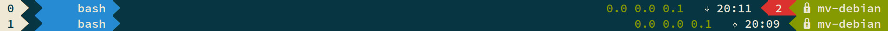

# Role: tmux

Configuration of tmux for SOSETH use.
Differences to vanilla tmux:
- Alt-x as an additional prefix
- <prefix>-b and <prefix>-x to send prefix (useful for nested tmux in, say, ssh)
- mouse support: Click on tabs or use your mouse wheel to scroll. Can be disabled using <prefix>-M and reenabled using <prefix>-m
- Panes and windows start counting at one instead of zero

## Powerline
Screenshot:

Right-to-left: Hostname, number of attached clients if bigger than one, current time, system load

### I can't see the symbols!
Unfortunately, for full powerline support, one needs to patch the local font with certain glyphs or use a pre-patched font(https://github.com/powerline/fonts).

